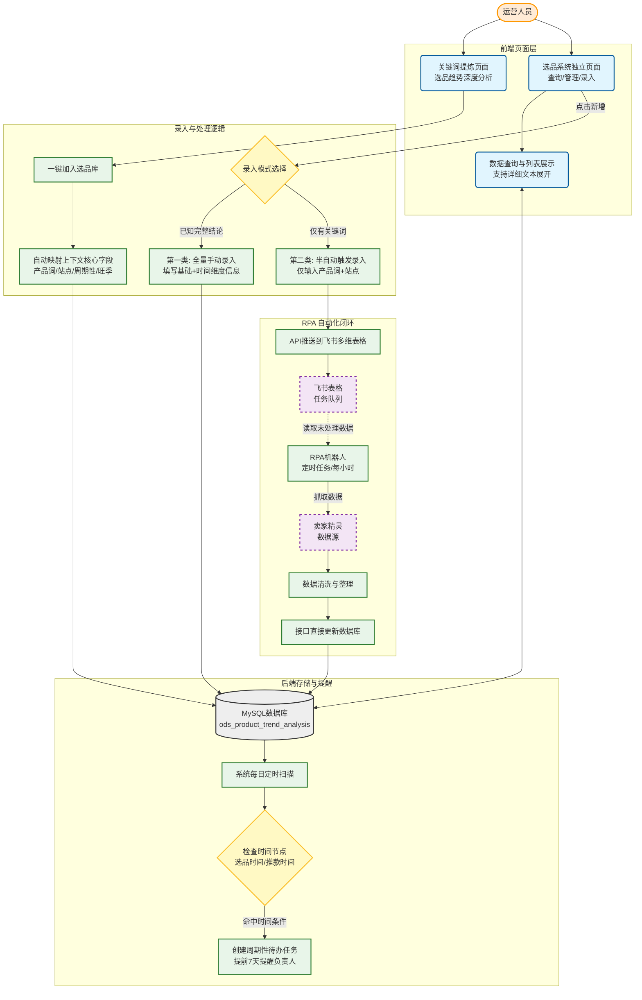

```mermaid
graph TD
    %% 定义样式
    classDef actor fill:#ffebd6,stroke:#ff9800,stroke-width:2px;
    classDef ui fill:#e1f5fe,stroke:#01579b,stroke-width:2px,rx:5,ry:5;
    classDef process fill:#e8f5e9,stroke:#2e7d32,stroke-width:2px;
    classDef decision fill:#fff9c4,stroke:#fbc02d,stroke-width:2px,shape:rhombus;
    classDef db fill:#eee,stroke:#333,stroke-width:2px,shape:cylinder;
    classDef ext fill:#f3e5f5,stroke:#7b1fa2,stroke-width:2px,stroke-dasharray: 5 5;

    %% 角色
    User([运营人员]):::actor

    %% 前端页面层
    subgraph UI_Layer [前端页面层]
        TrendPage[关键词提炼页面<br>选品趋势深度分析]:::ui
        SystemPage[选品系统独立页面<br>查询/管理/录入]:::ui
        QueryDisplay[数据查询与列表展示<br>支持详细文本展开]:::ui
    end

    %% 业务逻辑层
    subgraph Logic_Layer [录入与处理逻辑]
        OneClick[一键加入选品库]:::process
        AutoMap[自动映射上下文核心字段<br>产品词/站点/周期性/旺季]:::process
        
        InputType{录入模式选择}:::decision
        Type1[第一类: 全量手动录入<br>填写基础+时间维度信息]:::process
        Type2[第二类: 半自动触发录入<br>仅输入产品词+站点]:::process
    end

    %% RPA自动化层
    subgraph RPA_Layer [RPA 自动化闭环]
        PushFeishu[API推送到飞书多维表格]:::process
        FeishuTable[飞书表格<br>任务队列]:::ext
        RPABot[RPA机器人<br>定时任务/每小时]:::process
        SellerSprite[卖家精灵<br>数据源]:::ext
        DataClean[数据清洗与整理]:::process
        DBUpdate[接口直接更新数据库]:::process
    end

    %% 存储与提醒层
    subgraph Backend_Layer [后端存储与提醒]
        DB[(MySQL数据库<br>ods_product_trend_analysis)]:::db
        DailyScan[系统每日定时扫描]:::process
        TimeCheck{检查时间节点<br>选品时间/推款时间}:::decision
        CreateTodo[创建周期性待办任务<br>提前7天提醒负责人]:::process
    end

    %% 连线关系
    User --> TrendPage
    User --> SystemPage

    %% 路径1：关键词提炼
    TrendPage --> OneClick
    OneClick --> AutoMap
    AutoMap --> DB

    %% 路径2：系统页面操作
    SystemPage --> QueryDisplay
    QueryDisplay <--> DB
    SystemPage -- 点击新增 --> InputType

    %% 分支1：全量录入
    InputType -- 已知完整结论 --> Type1
    Type1 --> DB

    %% 分支2：RPA辅助
    InputType -- 仅有关键词 --> Type2
    Type2 --> PushFeishu
    PushFeishu --> FeishuTable
    
    %% RPA流程
    FeishuTable -. 读取未处理数据 .-> RPABot
    RPABot -- 抓取数据 --> SellerSprite
    SellerSprite --> DataClean
    DataClean --> DBUpdate
    DBUpdate --> DB

    %% 待办提醒流程
    DB --> DailyScan
    DailyScan --> TimeCheck
    TimeCheck -- 命中时间条件 --> CreateTodo
```