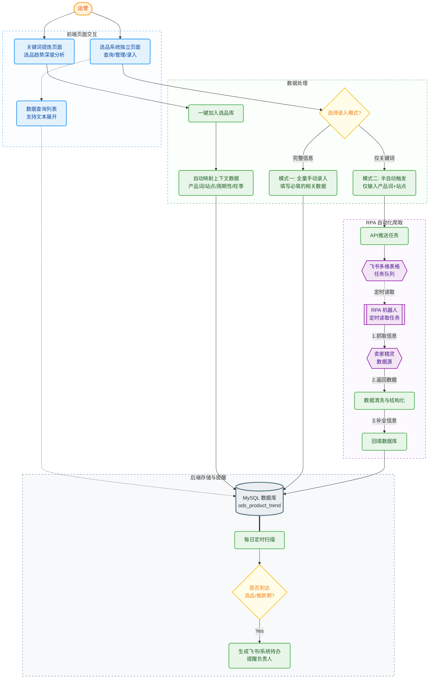

```mermaid
graph TD    
    classDef actorStyle fill:#FFF3E0,stroke:#FF9800,stroke-width:2px,color:#E65100,rx:20,ry:20;
    classDef uiStyle fill:#E3F2FD,stroke:#2196F3,stroke-width:2px,color:#0D47A1,rx:5,ry:5;
    classDef processStyle fill:#E8F5E9,stroke:#4CAF50,stroke-width:2px,color:#1B5E20,rx:5,ry:5;
    classDef decisionStyle fill:#FFFDE7,stroke:#FBC02D,stroke-width:2px,color:#F57F17,shape:rhombus;
    classDef extStyle fill:#F3E5F5,stroke:#9C27B0,stroke-width:2px,color:#4A148C,shape:hexagon;
    classDef dbStyle fill:#ECEFF1,stroke:#607D8B,stroke-width:3px,color:#263238,shape:cylinder;

    %% 节点

    User([运营]):::actorStyle

    %% 前端页面交互
    subgraph UI_Group [ 前端页面交互 ]
        direction TB
        TrendPage[关键词提炼页面<br>选品趋势深度分析]:::uiStyle
        SystemPage[选品系统独立页面<br>查询/管理/录入]:::uiStyle
        QueryDisplay[数据查询列表<br>支持文本展开]:::uiStyle
    end

    %% 数据录入
    subgraph Logic_Group [ 数据处理 ]
        OneClick[一键加入选品库]:::processStyle
        AutoMap[自动映射上下文数据<br>产品词/站点/周期性/旺季]:::processStyle
        
        InputType{选择录入模式?}:::decisionStyle
        
        Type1[模式一: 全量手动录入<br>填写必填的相关数据]:::processStyle
        Type2[模式二: 半自动触发<br>仅输入产品词+站点]:::processStyle
    end

    %% RPA自动化
    subgraph RPA_Group [ RPA 自动化爬取 ]
        direction TB
        PushFeishu[API推送任务]:::processStyle
        FeishuTable{{飞书多维表格<br>任务队列}}:::extStyle
        RPABot[[RPA 机器人<br>定时读取任务]]:::extStyle
        SellerSprite{{卖家精灵<br>数据源}}:::extStyle
        DataClean[数据清洗与结构化]:::processStyle
        DBUpdate[回填数据库]:::processStyle
    end

    %% 后端存储与提醒
    subgraph Backend_Group [ 后端存储与提醒 ]
        DB[(MySQL 数据库<br>ods_product_trend)]:::dbStyle
        DailyScan[每日定时扫描]:::processStyle
        TimeCheck{是否到达<br>选品/推款期?}:::decisionStyle
        CreateTodo[生成飞书/系统待办<br>提醒负责人]:::processStyle
    end

    %% 连线
    
    %% 用户入口
    User --> TrendPage
    User --> SystemPage

    %% 页面交互细节
    SystemPage -.-> QueryDisplay
    QueryDisplay -.-> DB

    %% 路径A：一键录入
    TrendPage --> OneClick
    OneClick --> AutoMap
    AutoMap --> DB

    %% 路径B：手动录入分流
    SystemPage --> InputType
    InputType -- 完整信息 --> Type1
    Type1 --> DB
    
    %% 路径C：RPA流程
    InputType -- 仅关键词 --> Type2
    Type2 --> PushFeishu
    PushFeishu --> FeishuTable
    FeishuTable -. 定时读取 .-> RPABot
    RPABot -- 1.抓取信息 --> SellerSprite
    SellerSprite -- 2.返回数据 --> DataClean
    DataClean -- 3.补全信息 --> DBUpdate
    DBUpdate --> DB

    %% 提醒流程
    DB === DailyScan
    DailyScan --> TimeCheck
    TimeCheck -- Yes --> CreateTodo

    %% --子图背景样式
    style UI_Group fill:#fbfdff,stroke:#2196F3,stroke-dasharray: 5 5
    style RPA_Group fill:#fcfaff,stroke:#9C27B0,stroke-dasharray: 5 5
    style Logic_Group fill:#fafffb,stroke:#4CAF50,stroke-dasharray: 5 5
    style Backend_Group fill:#f7f9fa,stroke:#607D8B,stroke-dasharray: 5 5
```