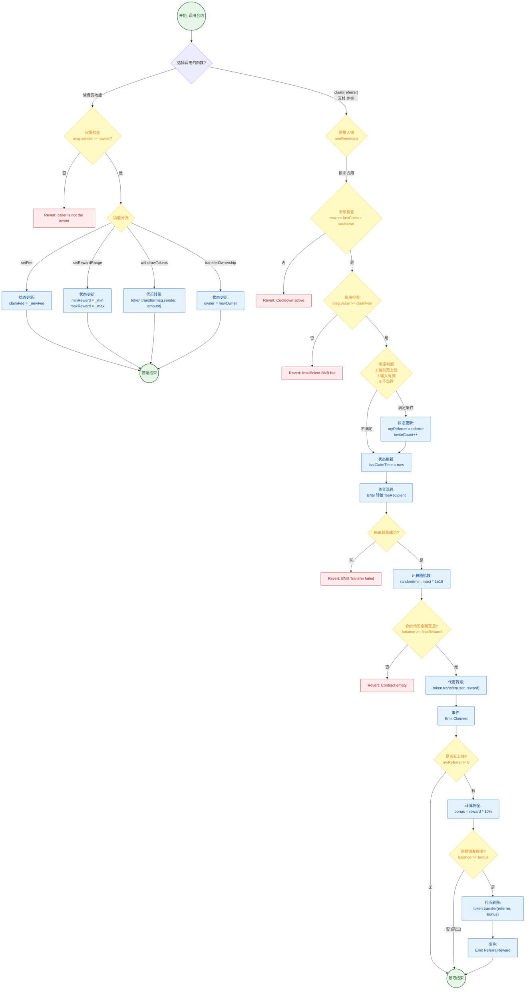

```mermaid
graph TB
    %% ================= 样式定义 =================
    classDef start fill:#e8f5e9,stroke:#2e7d32,stroke-width:2px,color:#1b5e20,rx:5,ry:5;
    classDef process fill:#e3f2fd,stroke:#1565c0,stroke-width:1px,color:#0d47a1,rx:2,ry:2;
    classDef decision fill:#fff9c4,stroke:#fbc02d,stroke-width:1px,shape:diamond,color:#f57f17,rx:5,ry:5;
    classDef endNode fill:#ffebee,stroke:#c62828,stroke-width:1px,color:#b71c1c,rx:2,ry:2;

    %% ================= 顶部入口 =================
    Root(("开始: 调用合约")):::start --> FuncSel{"选择调用的函数?"}

    %% ================= 左侧分支：管理员流程 (详细展开) =================
    FuncSel -- "管理员功能" --> AdminAuth{"权限检查<br>msg.sender == owner?"}:::decision
    
    AdminAuth -- 否 --> AdminErr["Revert: caller is not the owner"]:::endNode
    AdminAuth -- 是 --> AdminRouter{"功能分流"}:::decision

    %% 具体操作 1: 设置费用
    AdminRouter -- "setFee" --> SetFeeAction["状态更新:<br>claimFee = _newFee"]:::process
    SetFeeAction --> AdminDone(("管理结束")):::start

    %% 具体操作 2: 设置区间
    AdminRouter -- "setRewardRange" --> SetRangeAction["状态更新:<br>minReward = _min<br>maxReward = _max"]:::process
    SetRangeAction --> AdminDone

    %% 具体操作 3: 提取代币
    AdminRouter -- "withdrawTokens" --> WithdrawAction["代币转账:<br>token.transfer(msg.sender, amount)"]:::process
    WithdrawAction --> AdminDone
    
    %% 具体操作 4: 转移权限
    AdminRouter -- "transferOwnership" --> TransferOwn["状态更新:<br>owner = newOwner"]:::process
    TransferOwn --> AdminDone

    %% ================= 右侧分支：用户 Claim 流程 (详细步骤) =================
    FuncSel -- "claim(referrer)<br>支付 BNB" --> AntiReent{"防重入锁<br>nonReentrant"}:::decision

    %% 1. 基础检查
    AntiReent -- 锁未占用 --> CoolCheck{"冷却检查<br>now >= lastClaim + cooldown"}:::decision
    CoolCheck -- 否 --> ErrCool["Revert: Cooldown active"]:::endNode
    
    CoolCheck -- 是 --> FeeCheck{"费用检查<br>msg.value >= claimFee"}:::decision
    FeeCheck -- 否 --> ErrFee["Revert: Insufficient BNB fee"]:::endNode

    %% 2. 绑定逻辑
    FeeCheck -- 是 --> BindCheck{"绑定判断<br>1.当前无上线<br>2.输入有效<br>3.不自荐"}:::decision
    BindCheck -- 满足条件 --> DoBind["状态更新:<br>myReferrer = referrer<br>inviteCount++"]:::process
    BindCheck -- 不满足 --> UpdateTime["状态更新:<br>lastClaimTime = now"]:::process
    DoBind --> UpdateTime

    %% 3. 资金划转
    UpdateTime --> SendBNB["资金流转:<br>BNB 转给 feeRecipient"]:::process
    SendBNB --> BNBSuc{"BNB转账成功?"}:::decision
    BNBSuc -- 否 --> ErrBNB["Revert: BNB Transfer failed"]:::endNode

    %% 4. 奖励计算与发放
    BNBSuc -- 是 --> CalcRwd["计算随机数:<br>random(min, max) * 1e18"]:::process
    CalcRwd --> StockCheck{"合约代币余额充足?<br>balance >= finalReward"}:::decision
    StockCheck -- 否 --> ErrStock["Revert: Contract empty"]:::endNode
    
    StockCheck -- 是 --> TransferUser["代币转账:<br>token.transfer(user, reward)"]:::process
    TransferUser --> EmitClaim["事件:<br>Emit Claimed"]:::process

    %% 5. 佣金发放逻辑
    EmitClaim --> HasRef{"是否有上线?<br>myReferrer != 0"}:::decision
    HasRef -- 无 --> UserDone(("领取结束")):::start
    
    HasRef -- 有 --> CalcBonus["计算佣金:<br>bonus = reward * 10%"]:::process
    CalcBonus --> BonusStock{"余额够发佣金?<br>balance >= bonus"}:::decision
    
    BonusStock -- 否 (跳过) --> UserDone
    BonusStock -- 是 --> TransferRef["代币转账:<br>token.transfer(referrer, bonus)"]:::process
    TransferRef --> EmitRef["事件:<br>Emit ReferralReward"]:::process
    EmitRef --> UserDone
```