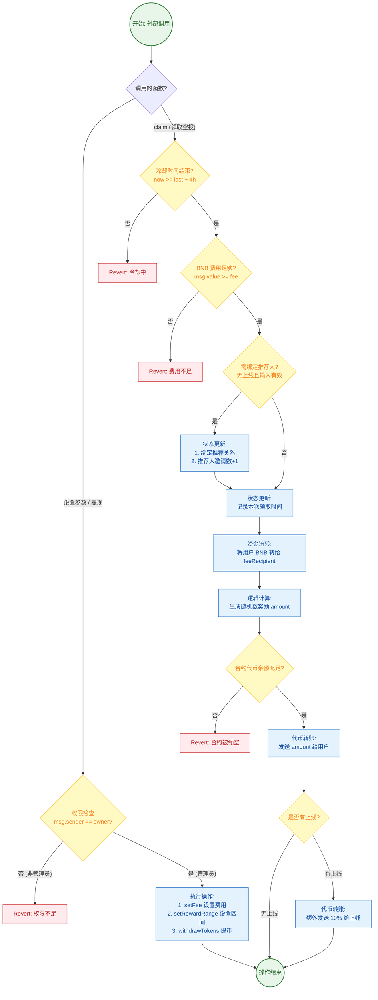

```mermaid
graph TD
    %% ================= 样式定义 =================
    classDef start fill:#e8f5e9,stroke:#2e7d32,stroke-width:2px,color:#1b5e20;
    classDef process fill:#e3f2fd,stroke:#1565c0,stroke-width:1px,color:#0d47a1;
    classDef decision fill:#fff9c4,stroke:#fbc02d,stroke-width:1px,shape:diamond,color:#f57f17;
    classDef endNode fill:#ffebee,stroke:#c62828,stroke-width:1px,color:#b71c1c;

    %% ================= 主流程开始 =================
    Entry((开始: 外部调用)):::start --> Route{调用的函数?}

    %% ================= 左侧：管理员分支 =================
    Route -- "设置参数 / 提现" --> AuthCheck{权限检查<br>msg.sender == owner?}:::decision
    
    AuthCheck -- "否 (非管理员)" --> RevertAuth[Revert: 权限不足]:::endNode
    AuthCheck -- "是 (管理员)" --> AdminAct[执行操作:<br>1. setFee 设置费用<br>2. setRewardRange 设置区间<br>3. withdrawTokens 提币]:::process
    AdminAct --> EndNormal((操作结束)):::start

    %% ================= 右侧：用户 Claim 分支 =================
    Route -- "claim (领取空投)" --> CheckTime{冷却时间结束?<br>now >= last + 4h}:::decision
    
    CheckTime -- 否 --> RevertTime[Revert: 冷却中]:::endNode
    CheckTime -- 是 --> CheckMoney{BNB 费用足够?<br>msg.value >= fee}:::decision
    
    CheckMoney -- 否 --> RevertFee[Revert: 费用不足]:::endNode
    CheckMoney -- 是 --> CheckBind{需绑定推荐人?<br>无上线且输入有效}:::decision
    
    CheckBind -- 是 --> BindRef[状态更新:<br>1. 绑定推荐关系<br>2. 推荐人邀请数+1]:::process
    CheckBind -- 否 --> UpdateTime[状态更新:<br>记录本次领取时间]:::process
    BindRef --> UpdateTime
    
    UpdateTime --> PayBNB[资金流转:<br>将用户 BNB 转给 feeRecipient]:::process
    PayBNB --> CalcRwd[逻辑计算:<br>生成随机数奖励 amount]:::process
    
    CalcRwd --> CheckStock{合约代币余额充足?}:::decision
    CheckStock -- 否 --> RevertStock[Revert: 合约被领空]:::endNode
    CheckStock -- 是 --> SendUser[代币转账:<br>发送 amount 给用户]:::process
    
    SendUser --> CheckBonus{是否有上线?}:::decision
    CheckBonus -- "无上线" --> EndNormal
    CheckBonus -- "有上线" --> SendRef[代币转账:<br>额外发送 10% 给上线]:::process
    SendRef --> EndNormal
```