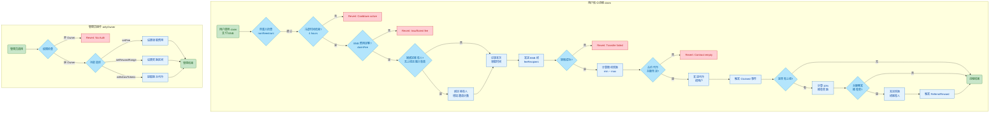

```mermaid
graph TB
    %% === 样式定义 ===
    classDef process fill:#e3f2fd,stroke:#1565c0,stroke-width:1px,color:#0d47a1;
    classDef decision fill:#b3e5fc,stroke:#0288d1,stroke-width:1px,color:#01579b,shape:diamond;
    classDef endNode fill:#ffcdd2,stroke:#c62828,stroke-width:1px,color:#b71c1c;
    classDef startNode fill:#c8e6c9,stroke:#2e7d32,stroke-width:1px,color:#1b5e20,shape:hexagon;

    %% === 用户流程 ===
    subgraph UserFlow [用户核心流程 claim]
        StartClaim(用户调用 claim<br>支付 BNB):::startNode --> GuardCheck{防重入检查<br>nonReentrant}
        
        GuardCheck -- 通过 --> CheckCooldown{冷却时间结束?<br>4 hours}
        
        CheckCooldown -- 否 --> RevertCooldown[Revert: Cooldown active]:::endNode
        CheckCooldown -- 是 --> CheckFee{BNB 费用足够?<br>claimFee}
        
        CheckFee -- 否 --> RevertFee[Revert: Insufficient fee]:::endNode
        CheckFee -- 是 --> CheckBind{需绑定推荐人?<br>无上线且输入有效}
        
        CheckBind -- 是 --> BindReferrer[绑定推荐人<br>增加邀请计数]:::process
        CheckBind -- 否 --> UpdateTime[记录本次<br>领取时间]:::process
        BindReferrer --> UpdateTime
        
        UpdateTime --> TransferBNB[发送 BNB 给<br>feeRecipient]:::process
        TransferBNB --> CheckBNBSuccess{转账成功?}
        
        CheckBNBSuccess -- 否 --> RevertBNB[Revert: Transfer failed]:::endNode
        CheckBNBSuccess -- 是 --> CalcReward[计算随机奖励<br>min ~ max]:::process
        
        CalcReward --> CheckTokenBalance{合约代币<br>余额充足?}
        CheckTokenBalance -- 否 --> RevertBalance[Revert: Contract empty]:::endNode
        CheckTokenBalance -- 是 --> TransferReward[发送代币<br>给用户]:::process
        
        TransferReward --> EmitClaimed[触发 Claimed 事件]:::process
        EmitClaimed --> CheckHasReferrer{是否有上线?}
        
        CheckHasReferrer -- 无 --> EndClaim(流程结束):::startNode
        CheckHasReferrer -- 有 --> CalcBonus[计算 10%<br>推荐奖励]:::process
        
        CalcBonus --> CheckBonusBalance{余额够发<br>推荐奖?}
        CheckBonusBalance -- 否 --> EndClaim
        CheckBonusBalance -- 是 --> TransferBonus[发送奖励<br>给推荐人]:::process
        TransferBonus --> EmitBonus[触发 ReferralReward]:::process
        EmitBonus --> EndClaim
    end

    %% === 管理员流程 ===
    subgraph OwnerFlow [管理员操作 onlyOwner]
        StartOwner(管理员调用):::startNode --> AuthCheck{权限检查}
        AuthCheck -- 非 Owner --> RevertAuth[Revert: No Auth]:::endNode
        AuthCheck -- 是 Owner --> FunctionSelect{功能选择}
        
        FunctionSelect -- setFee --> SetFeeAction[设置领取费用]:::process
        FunctionSelect -- setRewardRange --> SetRangeAction[设置奖励区间]:::process
        FunctionSelect -- withdrawTokens --> WithdrawAction[提取剩余代币]:::process
        
        SetFeeAction --> EndOwner(管理结束):::startNode
        SetRangeAction --> EndOwner
        WithdrawAction --> EndOwner
    end

    %% === 样式应用 ===
    class GuardCheck,CheckCooldown,CheckFee,CheckBind,CheckBNBSuccess,CheckTokenBalance,CheckHasReferrer,CheckBonusBalance,AuthCheck,FunctionSelect decision
```